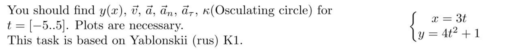
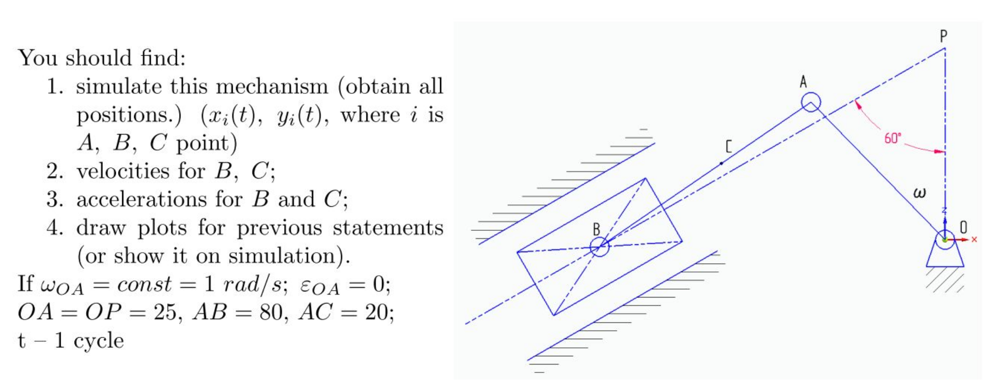
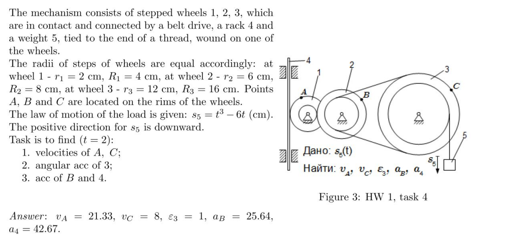

# Homework first week

## Task 1

### Simulation

### Solution

We have the system of $x(t)$ and $y(t)$, where $t\in[-5,5]$.

$$
\begin{cases}
x(t)=3t \\
y(t) = 4t^2+1
\end{cases}
$$

Into the task, we need to find the equation $y(x)$ and vectors: $\vec{v}$, $\vec{a}$, $\vec{a_{\tau}}$, $\vec{a_n}$

$$
\begin{cases}
x(t)=3t \\
y(t) = 4t^2+1
\end{cases} \to t=\frac{x}{3} \to \underline{\underline{y(x)=4\frac{x^2}{9}+1}}
$$

$v_x = \dot{x} = 3$

$v_y = \dot{y} = 8t$

$\underline{\underline{\vec{v}}} = v_x \vec{i} + v_y \vec{j} = \underline{\underline{3 \vec{i} + 8t \vec{j}}}$

$a_x = \ddot{x} = 0$

$a_y = \ddot{y} = 8$

$\underline{\underline{\vec{a}}} = a_x \vec{i} + a_y \vec{j} = \underline{\underline{0 \vec{i} + 8 \vec{j}}}$

$$
\underline{\underline{a_{\tau}}} = \frac{a*v}{v} = \underline{\underline{\frac{64t}{\sqrt{9+64t^2}}}}
$$

$$
\underline{\underline{a_n}} = \sqrt{a^2-a_{\tau}^2} = \underline{\underline{\frac{24}{\sqrt{9+64t^2}}}}
$$

$$
\underline{\underline{k}} = \frac{a_n}{v^2} = \underline{\underline{\frac{24}{(9+64t^2)^{\frac{3}{2}}}}}
$$

## Task 2

### Simulation

[Geogebra visualization](https://www.geogebra.org/m/kpebm7du)

### Solution

From the task we know that $OA = 25$, $AB = 80$, $AC = 20$, $w=const=1$, $\theta = 60$ deg.

All system work into the interval $t\in[0,2\pi]$

In the system we see that $OA$ is a radius of circle $O$, then $OA=R$

* Lets the function $th(t) = \frac{\pi}{2} + wt$ will give us the angle in position of $t$
* At first, we need to find the polar coordinates of point $A$

$$
\begin{cases}
x_a(t) = R*cos(th(t)) \\
y_a(t) = R*sin(th(t))
\end{cases}
$$

* To set the position of point B, we need to find the eq-n for coordinate $y_b(t)$

$$
y_b(t)=- cot(\theta)*x_b(t) + R
$$

* The next, find coordinate $x_b(t)$
* Using the eq-n $y_b(t)$ and Pythagoras' theorem to find distance between $A$ and $B$, we can build the system to
  determine the $x_b(t)$

$$
\begin{cases}
y_b(t)=- cot(\theta)*x_b(t) + R \\
(x_b - x_a)^2 + (y_b - y_a)^2 = AB^2
\end{cases}
$$

* To prettify the formula, let's divide it into the three part

$$
a = 1+cot(\theta)^2
$$

$$
b(t) = R(cot(\theta)*sin(th(t)) -2*cot(\theta)-2*cos(th(t)))
$$

$$
c(t) = R^2-R^2*sin(th(t))-AB^2
$$

$$
x_b(t) = \frac{-b(t) + \sqrt{b(t)^2-4*a*c(t)}}{2*a}
$$

* After that, we can find the velocity and acceleration of $B$

$$
v_b(t)=x_b'(t)\vec{i}+y_b'(t)\vec{j}
$$

$$
a_b(t)=x_b''(t)\vec{i}+y_b''(t)\vec{j}
$$

* To find position of point $C$, firstly we need to determine the path relatively the point $B$

$$
s(t)=\sqrt{(x_a(t)-x_b(t))^2+(y_a(t)-y_b(t))^2}
$$

$$
\begin{cases}
x_c(t)=x_b(t)+(AB-AC)\frac{x_a(t)-x_b(t)}{s(t)} \\
x_c(t)=y_b(t)+(AB-AC)\frac{y_a(t)-y_b(t)}{s(t)}
\end{cases}
$$

* After that, we can find the velocity and acceleration of $C$

$$
v_c(t)=x_c'(t)\vec{i}+y_c'(t)\vec{j}
$$

$$
a_c(t)=x_c''(t)\vec{i}+y_c''(t)\vec{j}
$$

$$
a^{\tau}_c(t)=\frac{a_c(t)*v_c(t)}{v_c(t)*v_c(t)}*v_c(t)
$$

$$
a^{n}_c(t)=a_c(t) - a^{\tau}_c(t)
$$

## Task 3

#### Given:

Circle 1: $r_1=2$, $R_1=4$

Circle 2: $r_2=6$, $R_2=8$

Circle 3: $r_3=12$, $R_3=16$

Block 5: $s_5(t)=t^3-6t$

At time point $t=2$

#### Need find

$v_a$, $v_c$, $v_a$, $a_b$, $a_4$

### Solution

At first we need find velocity and acceleration of block 5

$$
v_5=\dot{s_5}=3t^2-6
$$

$$
a_5=\ddot{s_5}=6t
$$

Now we need to find angular velocity and acceleration of circle 3

$$
v_5=w_3r_3 \to w_3=\frac{3t^2-6}{r_3}|_{t=2}=\frac{1}{2}
$$

$$
\underline{\underline{\varepsilon_3}}=\dot{w_3}=\underline{\underline{\frac{6t}{r_3}}} \to \varepsilon_3|_{t=2}=\underline{\underline{1}}
$$

Now we can find velocity at point $C$

$$
\underline{\underline{v_c}}=w_3R_3=\underline{\underline{\frac{(3t^2-6)R_3}{r_3}}} \to v_c|_{t=2}=\underline{\underline{8}}
$$

The module of linear velocities of points $C$ and $K$ are equel, point $K$ joined the small circle 2

$$
|v_k|=|v_c| \to w_2r_2= \frac{(3t^2-6)R_3}{r_3} \to w_2 = \frac{(3t^2-6)R_3}{r_3r_2}
$$

Now we can find velocity and acceleration at point $B$

$$
v_b=w_2R_2=\frac{(3t^2-6)R_3R_2}{r_3r_2}
$$

$$
\varepsilon_2=\dot(w_2)=\frac{6t*R_3}{r_3r_2}
$$

$$
a^{n}_b=w^2_2R_2= \frac{(3t^2-6)^2R_3^2R_2}{(r_3r_2)^2} \to a^{n}_b|_{t=2}=\frac{128}{9}
$$

$$
a^{\tau}_b=\varepsilon_2R_2= \frac{6t*R_3R_2}{r_3r_2} \to a^{\tau}_b|_{t=2}=\frac{64}{3}
$$

$$
\underline{\underline{a_b}}=\underline{\underline{\sqrt{(a^{\tau}_b)^2+(a^{n}_b)^2}}} \to \underline{\underline{a_b|_{t=2}}} = \underline{\underline{25.64}}
$$

The module of linear velocities of points $B$ and $L$ are equel, point $L$ joined the small circle 1

$$
|v_l|=|v_b| \to w_1r_1= \frac{(3t^2-6)R_3R_2}{r_3r_2} \to w_2 = \frac{(3t^2-6)R_3R_2}{r_3r_2r_1}
$$

Now we can find velocity and acceleration at point $A$

$$
\varepsilon_1=\dot(w_1)=\frac{6t*R_3R_2}{r_3r_2r_1}
$$

$$
\underline{\underline{v_a}}=w_1R_1=\underline{\underline{\frac{(3t^2-6)R_3R_2R_1}{r_3r_2}}} \to \underline{\underline{v_a|_{t=2}}}=\underline{\underline{21.33}}
$$

$$
a^{\tau}_a=\varepsilon_1R_1= \frac{6t*R_3R_2R_1}{r_3r_2r_1} \to a^{\tau}_b|_{t=2}=\frac{128}{3}
$$

The acceleraion of block 4 is equal of tangent acceleration component of point $A$

$$
\underline{\underline{v_4}} = a^{\tau}_a \to \underline{\underline{v_4|_{t=2}}}=\underline{\underline{42.67}}
$$

