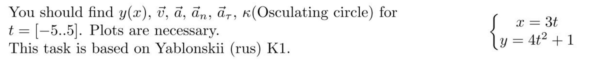
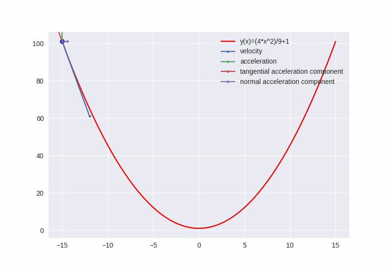

# Homework first week

## Initial step

```shell
sudo apt-get install python3.10-tk
```

## Task 1



### Simulation



### Solution
We have the system of $x(t)$ and $y(t)$, where $t\in[-5,5]$.

$$ 
\begin{cases} 
    x(t)=3t \\ 
    y(t) = 4t^2+1 
\end{cases} 
$$

Into the task, we need to find the equation $y(x)$ and vectors: $\vec{v}$, $\vec{a}$, $\vec{a_{\tau}}$, $\vec{a_n}$

$$ 
\begin{cases} 
    x(t)=3t \\ 
    y(t) = 4t^2+1 
\end{cases} \to t=\frac{x}{3} \to \underline{\underline{y(x)=4\frac{x^2}{9}+1}}
$$

$$
v_x = \dot{x} = 3 \\
v_y = \dot{y} = 8t \\
\underline{\underline{\vec{v}}} = v_x \vec{i} + v_y \vec{j} =  \underline{\underline{3 \vec{i} + 8t \vec{j}}}
$$

$$
a_x = \ddot{x} = 0 \\
a_y = \ddot{y} = 8 \\
\underline{\underline{\vec{a}}} = a_x \vec{i} + a_y \vec{j} =  \underline{\underline{0 \vec{i} + 8 \vec{j}}}
$$

$$
\underline{\underline{a_{\tau}}} = \frac{a*v}{v} = \underline{\underline{\frac{64t}{\sqrt{9+64t^2}}}}
$$

$$
\underline{\underline{a_n}} = \sqrt{a^2-a_{\tau}^2} = \underline{\underline{\frac{24}{\sqrt{9+64t^2}}}}
$$

