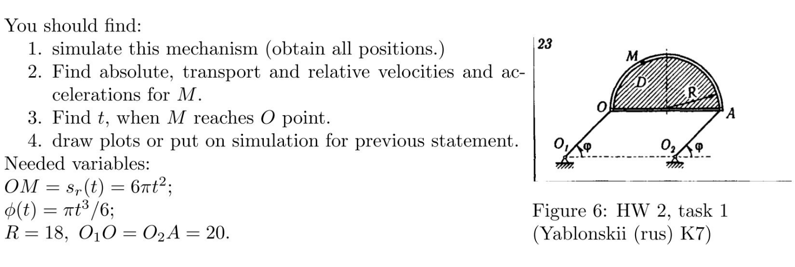

# Homework third week

## Task 1

### Simulation

[Geogebra link](https://www.geogebra.org/m/xnprbgq6)

### Solution

From the given data we need eq-n of the arc length $OM = s_r(t) = 6\pi*t^2$ and transform this to angle eq-n:

$$
\theta(t)=
\begin{cases}
-\frac{s_r(t)}{R} & 0 >= sin(\phi(t)) \\
\frac{s_r(t)}{R} & overwise
\end{cases}
$$

Now, we can calculate angular velocities and accelerations for $\phi(t)$ and $\theta(t)$:

$$
w_o(t) = \dot\phi = \frac{\pi * t^2}{2} \to \overrightarrow{w_o} = (0, 0, \pi * t^2 / 2)
$$

$$
\varepsilon_o(t)=\ddot\phi = \pi * t \to \overrightarrow{\varepsilon_o} = (0,0,\pi * t)
$$

$$
w_m(t) = \dot\theta = \frac{12\pi * t}{R} \to \overrightarrow{w_m} = (0, 0, \frac{12\pi * t}{R})
$$

$$
\varepsilon_m(t)=\ddot\theta = \frac{12\pi}{R} \to \overrightarrow{\varepsilon_m} = (0,0,\frac{12\pi}{R})
$$

Now, lets find the coordinates of points:

$$
r = O_1O = O_2A
$$

$$
X_O = 
\begin{bmatrix} 
rcos(\phi(t)) \\
rsin(\phi(t))
\end{bmatrix}
$$

$$
X_A = X_O + 
\begin{bmatrix} 
2R \\
0
\end{bmatrix}
$$

Point $N$ is a center of the circle $D$

$$
X_N = X_O + 
\begin{bmatrix} 
R \\
0
\end{bmatrix}
$$

$$
X_M = X_N + 
\begin{bmatrix} 
Rcos(\theta(t)) \\
Rsin(\theta(t))
\end{bmatrix}
$$

After that, lets find the absolute, transport, and relative velocity and acceleration for point $M$

$$
\overrightarrow{v^{tr}_M} = w_D*O_1M+\overrightarrow{v_D}=|| w_D=0 ||=\overrightarrow{v_D} = \overrightarrow{w_o} \times \overrightarrow{r}
$$

$$
\overrightarrow{v^{rel}_M} = \overrightarrow{w_m} \times \overrightarrow{R}
$$

$$
\overrightarrow{v_M} = \overrightarrow{v^{tr}_M} + \overrightarrow{v^{rel}_M}
$$

Accelerations:

$$
\underline{\underline{{{\overrightarrow{a^{tr}_M} = \overrightarrow{\varepsilon_o} \times \overrightarrow{r} + \overrightarrow{w_o} \times (\overrightarrow{w_o} \times \overrightarrow{r})}}}}
$$

$$
\underline{\underline{\overrightarrow{a^{rel}_M} = \overrightarrow{\varepsilon_m} \times \overrightarrow{R} + \overrightarrow{w_m} \times (\overrightarrow{w_m} \times \overrightarrow{R})}}
$$

$$
\underline{\underline{\overrightarrow{a_M} = \overrightarrow{a^{rel}_M} + \overrightarrow{a^{tr}_M} + \overrightarrow{a^{cor}_M} = ||\overrightarrow{a^{cor}_M} = 0|| = \overrightarrow{a^{rel}_M} + \overrightarrow{a^{tr}_M}}}
$$
