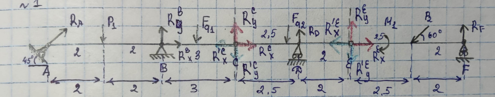

# Homework week 4

## Task 1

### Image

### Solution

> #### RO:
> 3 rigid bodies
> #### Method:
> static
> #### Fixed:
> $1^{st}$ body (ABC): $R_A, P_1, F_{q1}, R^B_X, R^B_Y, R^C_X, R^C_Y$
>
> $2^{nd}$ body (CDE): $R_D, F_{q2}, R^E_X, R^E_Y, R^{'C}_X, R^{'C}_Y$
>
> $3^{rd}$ body (EF): $R_F, M_1, P_2, R^{'E}_X, R^{'E}_Y$
> #### Force analysis:
> A(roller support): $R_A$ - ?
>
> B(cylindrical joint): $R^B_X$ - ?, $R^B_Y$ - ?
>
> C(joint): $|R^{'C}_X|=|R^C_X| - ?$, $|R^{'C}_Y|=|R^C_Y| - ?$
>
> D(roller support): $R_D$ - ?
>
> E(joint): $|R^{'E}_X|=|R^E_X| - ?$, $|R^{'E}_Y|=|R^E_Y| - ?$
>
> F(roller support): $R_F$ - ?
>
> ABC(rigid body): $P_1 = 12, F_{q1}=q*BC=4.2$
>
> CDE(rigid body): $F_{q2}=q*CE=6.3$
>
> EF(rigid body): $M_1=36, P_2=18$

At first, lets describe 3 eq-n for $1^{st}$ rigid body:

> ox: $R_A*cos(\alpha) + R^C_X+R^B_X=0$
>
> oy: $R_A * sin(\alpha) + R^C_Y + R^B_Y - P_1 - F_{q1} = 0$
>
> $M_B$: $P_1 * AB / 2 - R_A * sin(\alpha) * AB - F_{q1} * BC / 2 - R^C_Y * BC = 0$

Secondly, lets describe 3 eq-n for $2^{nd}$ rigid body:

> ox: $R^E_X-R^{'C}_X=0$
>
> oy: $R^E_Y - R^{'C}_Y - F_q1 + R_D = 0$
>
> $M_D$: $F_{q2} * (CD - \frac{CE}{2}) + R^{'C}_Y * CD + R^E_Y * DE = 0$

Finally, lets describe 3 eq-n for $3^{rd}$ rigid body:

> ox: $-R^{'E}_X - P_2 * cos(\beta) = 0$
>
> oy: $-R^{'E}_Y - P_2 * sin(\beta) + R_F = 0$
>
> $M_E$: $-M_1 - P_2 * sin(\beta) * EP_2 + R_F * EF = 0$

After that we can find 3 undefind variables from $3^{rd}$ rigid body

$$
\underline{R_F} = \frac{M_1 + P_2 * sin(\beta) * EP_2}{EF} = \frac{36+18*sin(60\deg)*2.5}{4.5} = 8+5\sqrt{3} =
\underline{16.66025}
$$

$$
\underline{R^{'E}_X} = -P_2*cos(\beta) = - 18*cos(60\deg) = \underline{-9} \to \underline{R^E_X} = -R^{'E}_X =
\underline{9}
$$

$$
\underline{R^{'E}_Y} = R_F-P_2*sin(\beta) = 8+5\sqrt{3} - 18*sin(60\deg)= 8-4\sqrt{3}=\underline{1.0718} \to
\underline{R^E_Y} = -R^{'E}_Y = \underline{-1.0718}
$$

Lets find next 3 undefind variables from $2^{rd}$ rigid body

$$
\underline{R^{'C}_X}=R^E_X = \underline{9} \to \underline{R^{C}_X} = -R^{'C}_X=\underline{-9}
$$

$$
\underline{R^{'C}_Y} = \frac{-F_{q2}*(CD+\frac{CE}{2})-R^E_Y*DE}{CD} = \frac{-6.3*0.5+1.0718*2}{2.5} =
\underline{-0.40256} \to\underline{R^C_Y}=-R^{'C}_Y = \underline{0.40256}
$$

$$
\underline{R_D} = F_{q2}+R^{'C}_Y - R^E_Y = 6.3 - 0.40256 + 1.0718 = \underline{6.96924}
$$

Lets find the last 3 undefind variables from $2^{rd}$ rigid body

$$
\underline{R_A} = \frac{P_1*\frac{AB}{2} - F_{q1}*\frac{BC}{2} - R^C_Y*BC}{sin(\alpha)*AB}=\frac{12*2-4.2*1.5-0.40256*
3}{sin(45\deg)*4}=\underline{5.83092}
$$

$$
\underline{R^B_X} = - R^C_X-R_A*cos(\alpha) = 9 - 5.83092 * cos(45\deg) = \underline{4.87692}
$$

$$
\underline{R^B_Y} = P_1+F_{q1} - R^C_Y - R_A*sin(\alpha) = 12 + 4.2 + 0.40256 - 5.83092 * sin(45\deg) =
\underline{12.47948}
$$

### Answer

> $R_F = 16.66025$
>
> $R^B_Y = 12.47948$
>
> $R^B_X = 4.87692$
>
> $R_A = 5.83092$
>
> $R_D = 6.96924$
>
> $|R^{'C}_Y|=|R^{C}_Y|=0.40256$
>
> $|R^{'C}_X|=|R^{C}_X|=9$
>
> $|R^{'E}_Y|=|R^{E}_Y|=1.0718$
>
> $|R^{'E}_X|=|R^{E}_X|=9$

## Task 2

### Image

### Solution

> #### RO:
> 1 rigid body
> #### Method:
> static
> #### Fixed:
> 1 rigid body: $R_1, R_2, R_3, R_4, R_5, R_6, G, P$
> #### Force analysis:
> 1 rigid body: $R_1 - ?, R_2 - ?, R_3 - ?, R_4 - ?, R_5 - ?, R_6 - ?, G = 18, P = 30$

Lets describe 6 eq-n for rigid body:

> ox: $-R_4 * \frac{a}{\sqrt{a^2 + c^2}} - R_6 * \frac{a}{\sqrt{a^2 + c^2}} = 0$
>
> oy: $P - R_2 * \frac{b}{\sqrt{b^2 + c^2}} = 0$
>
> oz: $R_1 + R_3 + R_5 + R_2 * \frac{c}{\sqrt{b^2 + c^2}} + R_4 * \frac{c}{\sqrt{a^2 + c^2}} + R_6 * \frac{c}{\sqrt{a^2 + c^2}} - G = 0$
>
> $M^D_x$: $-R_3 * b - R_5 * b - R_4 * b * \frac{c}{\sqrt{a^2 + c^2}} - G * \frac{b}{2} = 0$
>
> $M^D_y$: $R_5 * a - G * \frac{a}{2} = 0$
>
> $M^D_z$: $-P * a - R_4 * b * \frac{a}{\sqrt{a^2 + c^2}} = 0$

Now we can find all undefind vars

$$
R_5 = \frac{G}{2} = 9
$$

$$
R_2 = \frac{P * \sqrt{b^2 + c^2}}{b} = \frac{30 * \sqrt{16 + 3.5^2}}{4.5} = 38.00585
$$

$$
R_4 = \frac{-P * \sqrt{a^2 + c^2}}{b} = \frac{-30 * \sqrt{16 + 3.5^2}}{4.5} = -35.43382
$$

$$
R_6 = -R_4 = 35.43382
$$

$$
R_3 = -R_5 - R_4 * \frac{c}{\sqrt{a^2 + c^2}} - \frac{G}{2} = -9 + 35.43382 * \frac{3.5}{\sqrt{16 + 3.5^2}} - \frac{18}{2} = 5.33
$$

$$
R_1 = G - R_3 - R_5 - R_2 * \frac{c}{\sqrt{b^2 + c^2}} = 18 - 9 - 5.33 - 38.00585 * \frac{3.5}{\sqrt{4.5^2 + 3.5^2}} = -19.66333
$$

### Answer:

> $R_1 = -19.66333$
>
> $R_2 = 38.00585$
>
> $R_3 = 5.33333$
>
> $R_4 = -35.43382$
>
> $R_5 = 9$
>
> $R_6 = 35.43382$