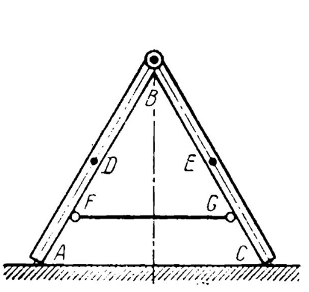

# Homework week 6

## Task 1

### Solution

> RO: A man
>
> Method: Change of angular momentum
>
> Force analysis:
> $G_a = m * g$, $G_b = m * g$
>
> Kinematic Analysis:
> $V_b = w * R$

Using the method, we can compute the velocity of load:

$$Q_1 - Q_0 = \sum{\int{F*dt}}$$

$$m * (a - V_b) - m * V_b - 0.25 * m * V_b = 0$$

$$a - 2 * V_b - 0.25 * V_b = 0$$

$$a = 2.25 * V_b$$

### Answer

$$V_b = \frac{4 * a}{9}$$

## Task 2

### Solution

> RO: step ladder
>
> Method: Energy conversation
>
> Force analysis:
> $G_E = m * g$, $G_D = m * g$
> $N_A - ?$, $N_C - ?$

#### Kinematic analysis

Let's express the velocity of the center of mass of the rod $BC$:

$$y_b = 2l*cos(\theta), x_e = l*sin(\theta), y_e = l*cos(\theta)$$

Let's differentiate them by time:

$$\dot{y_b} = -2l*sin(\theta) * \dot{\theta}$$

$$\dot{y_e} = -l*sin(\theta) * \dot{\theta}$$

$$\dot{x_e} = l*cos(\theta) * \dot{\theta}$$

Consequently:

$$|\dot{\theta}| = w = \frac{v_b}{2l*cos(\theta)}$$

$$v_e^2 = (\dot{y_e})^2 + (\dot{x_e})^2 = l^2 * w^2 = \frac{v^2_b}{4*cos(\theta)^2}$$

Using the theorem of conversation of Energy:

$$T = T_{AB} + T_{BC} = 2 * T_{BC} = m * v_e^2 + m * p^2 * w^2$$

Let's substitute the velocities:

$$T = \frac{m*v^2_b}{4*cos(\theta)^2} + \frac{m*p^2*v^2_b}{4l^2 * cos(\theta)^2} = \frac{m*v^2_b}{4*cos(\theta)^2} * \frac{(l^2 + p^2)}{l^2}$$

The gravity forces do the work:

$$A = \sum{Fds} = 2 * mg * (y_e(\theta_0) - y_e(\theta)) = 2mg*(\frac{lh}{2l} - l*cos(\theta)) = mg(h - lcos(\theta))$$

Consequently:

$$\frac{m*v^2_b}{4*cos(\theta)^2} * \frac{(l^2 + p^2)}{l^2} = mg(h - lcos(\theta))$$

$$v_b = 2l*sin(\theta) * \sqrt{\frac{g(h - lcos(\theta))}{l^2 + p^2}}$$

1. Need to find the velocity when point B will touch the floor, $\theta = 90\deg$

$$v_b = 2l * \sqrt{\frac{gh}{l^2 + p^2}}$$

2. Need to find the velocity when point B will be on half of $h$ from the floor, $cos(\theta) = \frac{h}{4l}, sin(\theta) = \sqrt{1 - \frac{h^2}{16l^2}}$

$$v_b = \frac{1}{2} * \sqrt{\frac{gh(16l^2 - h^2)}{2(l^2 + p^2)}}$$