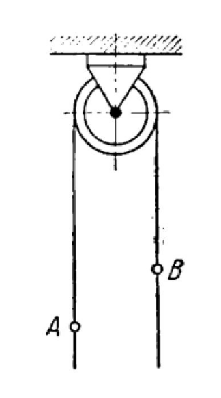

# Homework week 6

## Task 1

### Solution

> RO: A man
>
> Method: Change of angular momentum
>
> Force analysis:
> $G_a = m * g$, $G_b = m * g$
>
> Kinematic Analysis:
> $V_b = w * R$

Using the method, we can compute the velocity of load:

$$Q_1 - Q_0 = \sum{\int{F*dt}}$$

$$m * (a - V_b) - m * V_b - 0.25 * m * V_b = 0$$

$$a - 2 * V_b - 0.25 * V_b = 0$$

$$a = 2.25 * V_b$$

### Answer

$$V_b = \frac{4 * a}{9}$$