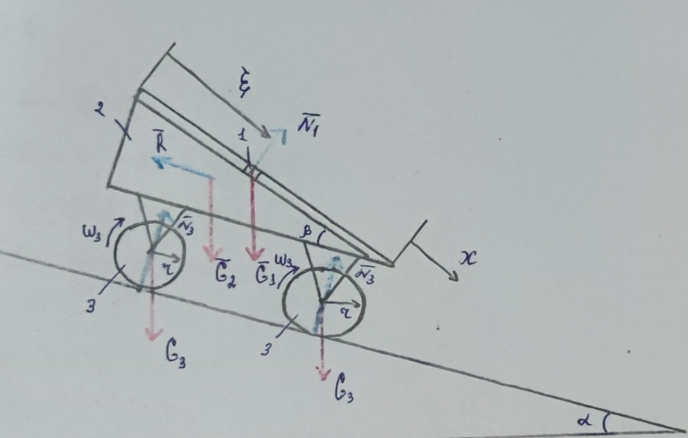

## Week 7 homework

### Simulation

[code](Solution.ipynb)

### Task

> RO:
> 1. particle (reactlinear motion)
> 2. rigid body (rectlinear motion)
> 3. homogeneous disk (rotation)
>
> Method: Euler-Lagrange
>
> Force analysis:
> 
> $G_1 = m_1 * g = 10$, $G_2 = m_2 * g = 30$, $G_3 = m_3 * g = 20$
> 
> $R = -b * \dot{x}$, $N_1 - ?$, $N_3 - ?$

#### Condition

|   | Initial | Final |
| -------- | -------- | -------- |
| $x$     | 0     | ?     |
| $\dot{x}$    | 0     | ?     |
| $\xi$     | 0     | ?     |
| $\dot{\xi}$     | 3     | ?     |
| $t$     | 0     | ?     |

#### Kinematic analysis:

$v_2 = \dot{x} = v_3 \to v_3 = w_3r \to w_3 = \frac{\dot{x}}{r}$

$v^2_1 = \dot{x}^2 + \dot{\xi}^2 + 2 * \dot{x} * \dot{\xi} * cos(\beta)$

#### Momentum of Inertion

$J_3 = \frac{1}{2} m_3 r^2_3 = r_3^2$

#### Solution

At first, lets calculate the kinematic and potential energy for each body:

$$T_1 = \frac{m_1 * v^2_1}{2} = \frac{\dot{x}^2 + \dot{\xi}^2 + 2\dot{x}\dot{\xi}cos(30^{\circ})}{2}$$

$$T_2 = \frac{m_2 * v^2_2}{2} = \frac{3\dot{x}^2}{2}$$

$$T_3 = \frac{m_3v^2_3}{2} + \frac{J_3w^2_3}{2} = \frac{3\dot{x}^2}{2}$$

$$T = T_1 + T_2 + 2T_3 = \frac{\dot{x}^2 + \dot{\xi}^2 + 2\dot{x}\dot{\xi}cos(30^{\circ})}{2} + \frac{3\dot{x}^2}{2} + 3\dot{x}^2 = 5\dot{x}^2 + (\dot{\xi}^2 + \dot{x}\dot{\xi}\sqrt{3}) * \frac{1}{2}$$

$$\Pi_1 = - G_1(x sin(\alpha) + \xi sin(\alpha + \beta)) = -5 (x + \xi \sqrt{3})$$

$$\Pi_2 = - G_2 x sin(\alpha) = -15x$$

$$\Pi_3 = - G_3 x sin(\alpha) = -10x$$

$$\Pi = \Pi_1 + \Pi_2 + 2 \Pi_3 = -5 (x + \xi \sqrt{3}) - 35x$$

To use the Euler-Lagrande eq-n we need to prepare the values and find work:

$$\frac{\delta T}{\delta \dot{x}} = 10 \dot{x} + 0.5 \dot{\xi} \sqrt{3}$$

$$\frac{\delta T}{\delta x} = 0$$

$$\frac{\delta \Pi}{\delta x} = -40$$

$$\frac{\delta T}{\delta \dot{\xi}} = \dot{\xi} + \dot{x} \frac{\sqrt{3}}{2}$$

$$\frac{\delta T}{\delta \xi} = 0$$

$$\frac{\delta \Pi}{\delta \xi} = -5 \sqrt{3}$$

$$N_x = -R \dot{x} \to Q_x = \frac{N_x}{\dot{x}} = -R$$

$$N_{\xi} = 0 \to Q_{\xi} = 0$$

Now we can substitute the values to Euler-Lagrange eq-n:

$$
\begin{cases}
\frac{d}{dt}(\frac{\delta T}{\delta \dot{x}}) - \frac{\delta T}{\delta x} = \frac{\delta \Pi}{\delta x} + Q_x \\
\frac{d}{dt}(\frac{\delta T}{\delta \dot{\xi}}) - \frac{\delta T}{\delta \xi} = \frac{\delta \Pi}{\delta \xi} + Q_{\xi} \\
\end{cases}
$$

$$
\begin{cases}
10 \ddot{x} + \frac{\sqrt{3}}{2} \ddot{\xi} - 0 = -40 + 0.001 \dot{x} \\
\ddot{\xi} + \frac{\sqrt{3}}{2} \ddot{x} - 0 = -5 \sqrt{3} + 0 \\
\end{cases}
$$

Lets express $\ddot{\xi}$ from the second eq-n and substitute to the first one to find $x$:

$$\ddot{\xi} = -\frac{\sqrt{3}}{2} \ddot{x} -5 \sqrt{3}$$

$$9.25 \ddot{x} - 0.001 \dot{x} + 32.5 = 0$$

To solve the second order differential eq-n, lets substitute the constance: $a = 9.25$, $b = 0.001$, $c = 32.5$. At first step we need to substitute the $z = \dot{x}$, then $\dot{z} = \ddot{x}$:

$$\int \frac{dz}{bz - c} = \int \frac{dt}{a} \to \dot{x} = K_1 e^{\frac{bt}{a}} + \frac{c}{b}$$

Using the condition we can find the $K_1 = const$, where $t_0 = 0$ and $\dot{x_0} = 0$. So, we have that $K_1 = -\frac{c}{b}$:

$$\dot{x} = - \frac{c}{b} e^{\frac{bt}{a}} + \frac{c}{b}$$

Now we can find the displacement $x$:

$$x = - \frac{ac}{b^2} e^{\frac{bt}{a}} + \frac{ct}{b} + K_2$$

Using the condition we can find the $K_2 = const$, where $t_0 = 0$ and $x_0 = 0$. So, we have that $K_2 = \frac{ac}{b^2}$:

$$x = - \frac{ac}{b^2} e^{\frac{bt}{a}} + \frac{ct}{b} + \frac{ac}{b^2}$$

Now lets find the acceleration $\ddot{x}$ for $x$:

$$\ddot{x} = - \frac{c}{a} e^{\frac{bt}{a}}$$

Lets substitute the $\ddot{x}$ to eq-n of $\ddot{\xi}$, before it lets express numerical values to chars: $d = \frac{\sqrt{3}}{2}$, and $f = 5\sqrt{3}$:

$$\ddot{\xi} = -f - d \ddot{x} = \frac{cd}{a} e^{\frac{bt}{a}} - f$$

Lets differentiat this:

$$\dot{\xi} = \frac{ad}{b} e^{\frac{bt}{a}} - ft + K_3$$

Using the condition we can find the $K_3 = const$, where $t_0 = 0$ and $\dot{\xi_0} = 3$. So, we have that $K_2 = 3 - \frac{ad}{b}$:

$$\dot{\xi} = \frac{ad}{b} e^{\frac{bt}{a}} - ft + (3 - \frac{ad}{b})$$

Then:

$$\xi = \frac{a^2d}{b^2} e^{\frac{bt}{a}} - \frac{ft^2}{2} + (3 - \frac{ad}{b})t + K_4$$

Using the condition we can find the $K_4 = const$, where $t_0 = 0$ and $\xi_0 = 0$. So, we have that $K_4 = - \frac{a^2 d}{b^2}$:

$$\xi = \frac{a^2d}{b^2} e^{\frac{bt}{a}} - \frac{ft^2}{2} + (3 - \frac{ad}{b})t + - \frac{a^2 d}{b^2}$$

Lets substitute the values:

$$x = 300625000 * (1 - e^{\frac{t}{9250}}) + 32500 t$$

$$\xi = 42781250 \sqrt{3} (e^{\frac{t}{9250}} - 1) - 2.5 \sqrt{3} t^2 + (3 - 4625 \sqrt{3})$$

#### Answer:

$$x = 300625000 * (1 - e^{\frac{t}{9250}}) + 32500 t$$

$$\xi = 42781250 \sqrt{3} (e^{\frac{t}{9250}} - 1) - 2.5 \sqrt{3} t^2 + (3 - 4625 \sqrt{3})$$
